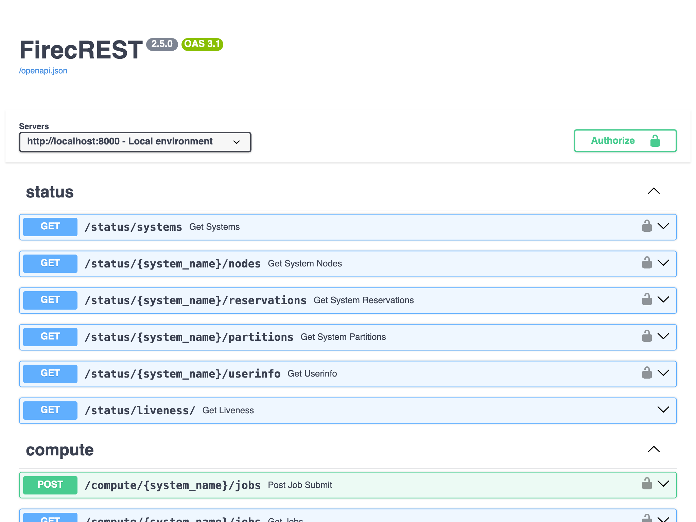
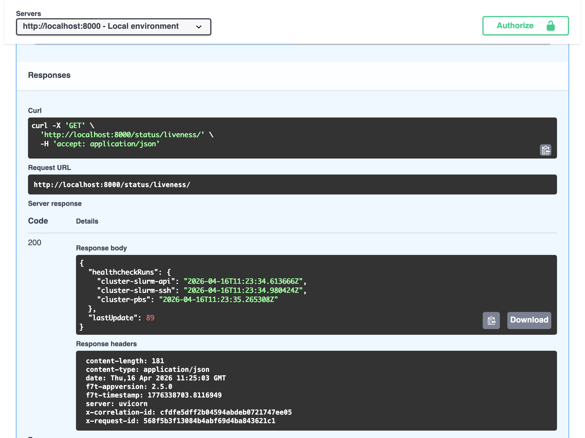
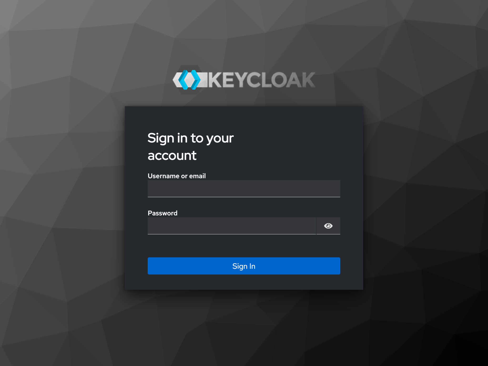
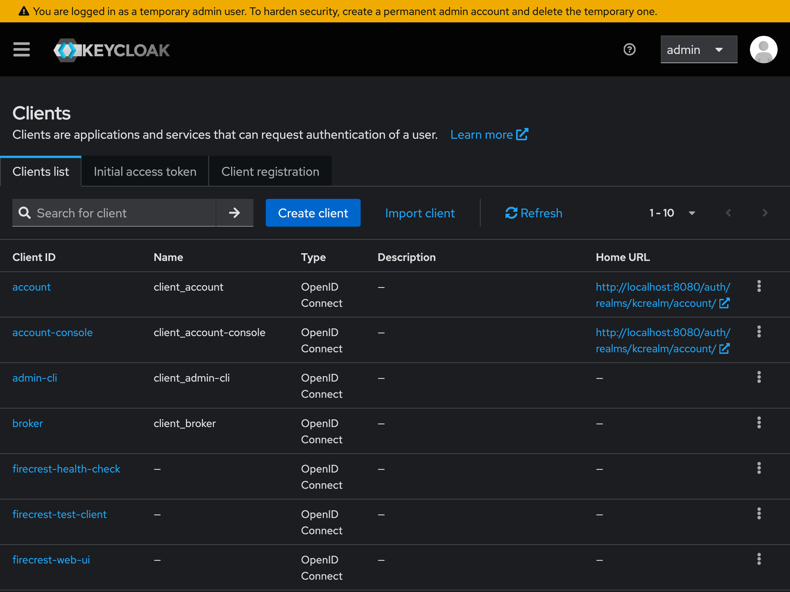

# FirecREST in your laptop

## Introduction

The FirecREST repository contains the definition for a preconfigured containerized FirecREST environment which can deployed locally.

In addition to FirecREST, the environment includes a minimal set of networked containers representing a simple API-accessible supercomputing infrastructure: IAM service, S3 compatible storage, SSH certificate authority, batch compute cluster.

The environment is defined using the [Compose specification][compose-spec], and can be deployed locally using a Compose-compatible tool, such as [Docker Compose][docker-compose]

The containerized is useful for

* Understanding of how FirecREST interacts with other infrastructure components
* Exploring how FirecREST can be configured to interact with your own local supercomputing infrastructure
* Testing and developing user workflows with FirecREST

[compose-spec]: https://compose-spec.io/
[docker-compose]: https://docs.docker.com/compose/

## Learning objectives

This demo will provide attendees with an introduction to the containerized FirecREST environment, covering

* Bringing up the containerized environment on a locally (e.g. on a laptop)
* The structure of the environment and relationship between components
* Making API calls to FirecREST within the environment
* Interacting with other components of the environment

After the session, attendees will be equipped to deploy the environment for themselves and explore the capabilities of FirecREST in self-contained environment.

## 0. Setup

The host on which the containerised environment is deployed requires the following:

1. OCI container engine (**[Podman][podman]**, [Docker][docker], [nerdctl][nerdctl])
1. Compose compatible orchestrator (**[Docker Compose][docker-compose]**, [Podman Compose][podman-compose], [nerdctl][nerdctl])
1. Tool for making HTTP requests (**[curl][curl]**, [httpie][httpie], Python [requests][python-requests])
1. Tool for parsing JSON (**[jq][jq]**, [yq][yq], Python standard library [json][python-json])
1. **[Git][git]** version control system

In this demo, the tools in **bold** above are used, but the instructions should generalise to other combinations.

!!! note "`podman compose`"
    This demo uses the Podman container engine and Docker Compose orchestrator using the [`podman compose`][podman-compose-command-man-page] command. Docker Compose is the reference implementation of the [Compose spec][compose-spec] and widely supported.

    Confusingly, running the `podman compose` command from does not imply using the [Podman Compose][podman-compose] orchestrator. The `podman compose` command will default to using Docker Compose as orchestrator if available on the system (but can also use Podman Compose as orchestrator).

[podman]: https://podman.io/
[docker]: https://www.docker.com/
[nerdctl]: https://github.com/containerd/nerdctl
[podman-compose]: https://github.com/containers/podman-compose
[podman-compose-command-man-page]: https://docs.podman.io/en/latest/markdown/podman-compose.1.html
[curl]: https://curl.se/
[httpie]: https://httpie.io/
[python-requests]: https://docs.python-requests.org/
[jq]: https://jqlang.org/
[yq]: https://github.com/mikefarah/yq
[python-json]: https://docs.python.org/3/library/json.html
[git]: https://git-scm.com/

## 1. Deploy the environment

Clone the [firecrest-v2 GitHub repository][firecrest-v2-github] and check out release v2.5.0

```shell
git clone https://github.com/eth-cscs/firecrest-v2.git
cd firecrest-v2
git switch --detach 2.5.0
```

Bring up the Compose project

```shell
podman compose -f docker-compose.yml up
```

This will pull and build the necessary container images and build the containerised environment as defined in [`docker-compose.yml`][docker-compose-firecrest-v2-github].
The first time this is done, it may take a few minutes to completely bring up the environment.

Confirm that the Compose project is running

```shell-session
$ podman compose ls
NAME                STATUS              CONFIG FILES
firecrest-v2        running(5)          /path/to/firecrest-v2/docker-compose.yml
```
[firecrest-v2-github]: https://github.com/eth-cscs/firecrest-v2
[docker-compose-firecrest-v2-github]: https://github.com/eth-cscs/firecrest-v2/blob/2.5.0/docker-compose.yml

## 2. Explore the environment

List the running containers in the project

```shell-session
$ podman compose -p firecrest-v2 ps       
NAME                       IMAGE                                  COMMAND                  SERVICE     CREATED          STATUS          PORTS
firecrest-v2-firecrest-1   docker.io/library/firecrestv2:latest   "sh -c python3 -Xfro…"   firecrest   16 minutes ago   Up 16 minutes   127.0.0.1:5678->5678/tcp, 127.0.0.1:8000->5000/tcp
firecrest-v2-keycloak-1    quay.io/keycloak/keycloak:26.0.7       "start-dev --http-re…"   keycloak    16 minutes ago   Up 17 minutes   127.0.0.1:8080->8080/tcp, 8443/tcp, 127.0.0.1:9090->9000/tcp
firecrest-v2-minio-1       docker.io/minio/minio:latest           "minio server /data …"   minio       16 minutes ago   Up 17 minutes   127.0.0.1:9000-9001->9000-9001/tcp
firecrest-v2-pbs-1         docker.io/library/openpbs:23.06.06     "/usr/bin/supervisord"   pbs         16 minutes ago   Up 17 minutes   5432/tcp, 15004-15007/tcp, 127.0.0.1:15001-15003->15001-15003/tcp, 127.0.0.1:2223->22/tcp
firecrest-v2-slurm-1       docker.io/library/slurm:latest         ""                       slurm       16 minutes ago   Up 16 minutes   127.0.0.1:5665-5666->5665-5666/tcp, 127.0.0.1:6820->6820/tcp, 127.0.0.1:2222->22/tcp
```

The "Service" column shows how the containers are mapped to the [Compose services][services-compose-spec] defined in [`docker-compose.yml`][docker-compose-firecrest-v2-github].

The "Ports" column shows which ports the containerised services are bound to.

The services running in the Compose project map to the components of the full FirecREST architecture


| Architecture component       | Containerised service |
| ---------------------------- | --------------------- |
| Identity provider            | `keycloak`            |
| Workload scheduler & manager | `slurm` and `pbs`     |
| Object storage               | `minio`               |

View the FirecREST Swagger UI in a web browser by going to <http://localhost:8000/docs>



It is possible to make requests to the API endpoints from the Swagger UI. For example, selecting the "Try it out" button and then "Execute" button for the unauthenticated `/status/liveness/` endpoint makes a GET request and the response is displayed in the browser.



For this demo, we will be exploring the API using command line tools.

[services-compose-spec]: https://github.com/compose-spec/compose-spec/blob/main/05-services.md

## 3. Acquire an access token

## 4. Call the FirecREST API

### `curl`

### pyfirecrest

## 5. Interact with other components

We can also access the web interfaces and APIs of other service components.

Open the Keycloak web UI by going to <http://localhost:8080/auth>



You can log in to the containerised Keycloak service with preconfigured admin credentials.

!!! info "Keycloak admin credentials"
    For the containerised development environment, Keycloak admin credentials are set to

    **Username:** admin  
    **Password:** admin2

    In production secure, secret credentials should be used!

This is useful for exploring and developing IAM configuration associated with FirecREST. For example, opening the "Clients" page in the realm "kcrealm" will show OpenID Connect clients configured for use with FirecREST.


