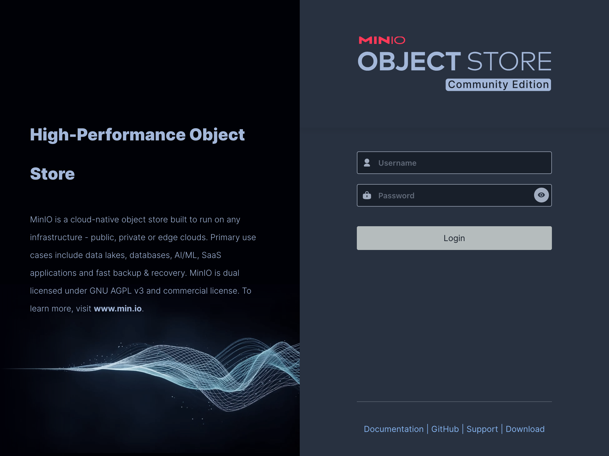
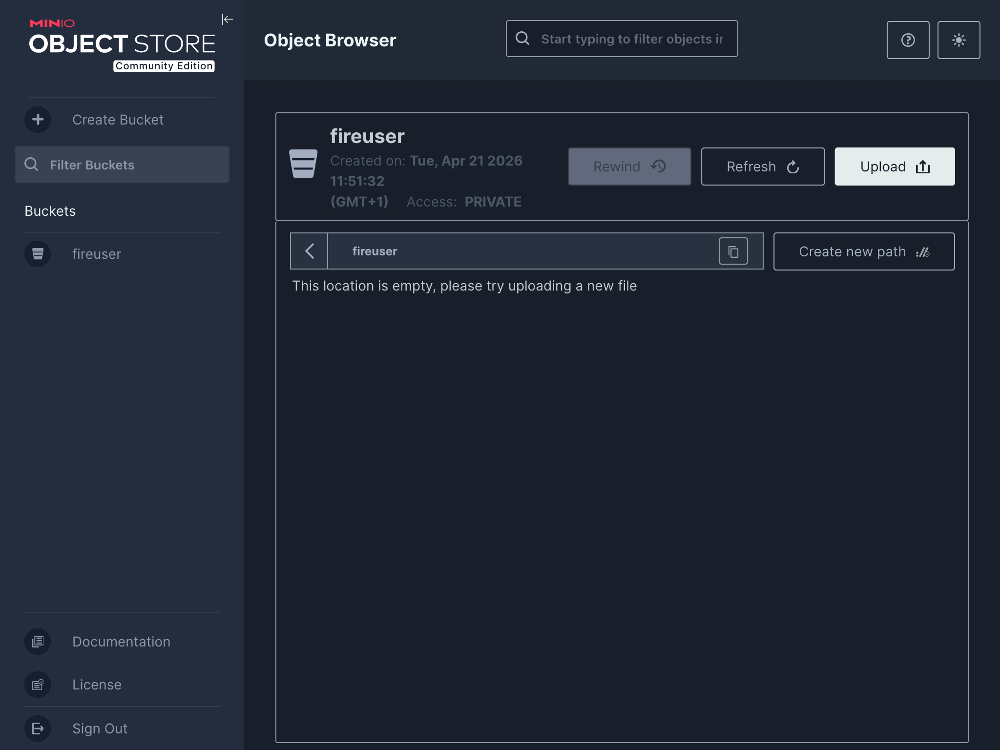

# FirecREST in your laptop
<!-- markdownlint-configure-file 
{
    "default": true,
    "MD007": {
        "indent": 4
    },
    "MD013": false,
    "MD014": false,
    "MD024": {
        "siblings_only": true
    },
    "MD033": false,
    "MD046": false,
    "MD053": false
}
-->

## Introduction

The FirecREST repository contains the definition for a preconfigured containerized FirecREST environment which can be deployed locally.

In addition to FirecREST, the environment includes a minimal set of networked containers representing a simple API-accessible supercomputing infrastructure: IAM service, S3 compatible storage, batch compute cluster.

The environment is defined using the [Compose specification][compose-spec], and can be deployed locally using a Compose-compatible tool, such as [Docker Compose][docker-compose]

The containerized environment is useful for

* Understanding how FirecREST interacts with other infrastructure components in a supercomputing centre
* Exploring how FirecREST can be configured to interact with your own local supercomputing infrastructure
* Testing and developing user workflows with FirecREST

[compose-spec]: https://compose-spec.io/
[docker-compose]: https://docs.docker.com/compose/

## Learning objectives

This demo will provide attendees with an introduction to the containerized FirecREST environment, covering

* Bringing up the containerized environment locally (e.g. on a laptop)
* The structure of the environment and relationship between components
* Making API calls to FirecREST within the environment
* Interacting with other components of the environment

After the session, attendees will be equipped to deploy the environment for themselves and explore the capabilities of FirecREST in self-contained environment.

## 0. Setup

The host on which the containerised environment is deployed requires the following:

1. OCI container engine (**[Podman][podman]**, [Docker][docker], [nerdctl][nerdctl])
1. Compose compatible orchestrator (**[Docker Compose][docker-compose]**, [Podman Compose][podman-compose], [nerdctl][nerdctl])
1. Tool for making HTTP requests (**[curl][curl]**, [httpie][httpie], Python [requests][python-requests])
1. Tool for parsing JSON (**[jq][jq]**, [yq][yq], Python standard library [json][python-json])
1. Tool for decoding base64 strings (**[Python][python]** interpreter, [base64][base64-gnu-coreutils])
1. **[Git][git]** version control system

In this demo, the tools in **bold** above are used, but the instructions should generalise to other combinations.

!!! note "`podman compose`"
    This demo uses the Podman container engine and Docker Compose orchestrator using the [`podman compose`][podman-compose-command-man-page] command. Docker Compose is the reference implementation of the [Compose spec][compose-spec] and widely supported.

    Confusingly, running the `podman compose` command from does not imply using the [Podman Compose][podman-compose] orchestrator. The `podman compose` command will default to using Docker Compose as orchestrator if available on the system (but can also use Podman Compose as orchestrator).

??? info "Quick start: Lima"
    [Lima][lima-vm] is a tool for easily launching and managing virtual machines.
    It can be used to quickly bring up a virtual machine suitable for deploying and working with the containerised environment:

    [Install Lima][installation-lima-vm], e.g. from [Homebrew]

    ```shell
    brew install lima
    ```

    Create a VM instance from the [Podman template][podman-template-lima-vm] named `f7t-podman`

    ```shell
    limactl create --name=f7t-podman --cpus=5 --disk=50 --memory=4 --mount-none template:podman
    ```

    Start the instance

    ```shell
    limactl start f7t-podman
    ```

    Start a shell in the instance

    ```shell
    limactl shell f7t-podman
    ```

    Upgrade packages and install Docker Compose (plus other useful tools)

    ```shell
    sudo dnf --refresh upgrade
    sudo dnf install curl docker-compose git jq python3 tmux vim-enhanced
    ```

    Set some Podman configuration values

    ```shell
    mkdir -v -p ${XDG_CONFIG_HOME:-${HOME}/.config}/containers
    cat > ${XDG_CONFIG_HOME:-${HOME}/.config}/containers/containers.conf <<EOF
    [containers]
    label = false

    [engine]
    compose_providers = ["/usr/bin/docker-compose"]
    compose_warning_logs = false
    EOF
    ```

    After following the above steps, the VM can be used to work through the steps in this guide.

    When finished with the Lima VM, stop it by running the following on the host

    ```shell
    limactl stop f7t-podman
    ```

[podman]: https://podman.io/
[docker]: https://www.docker.com/
[nerdctl]: https://github.com/containerd/nerdctl
[podman-compose]: https://github.com/containers/podman-compose
[podman-compose-command-man-page]: https://docs.podman.io/en/latest/markdown/podman-compose.1.html
[curl]: https://curl.se/
[httpie]: https://httpie.io/
[python-requests]: https://docs.python-requests.org/
[jq]: https://jqlang.org/
[yq]: https://github.com/mikefarah/yq
[python-json]: https://docs.python.org/3/library/json.html
[git]: https://git-scm.com/
[python]: https://www.python.org/
[base64-gnu-coreutils]: https://www.gnu.org/software/coreutils/manual/html_node/base64-invocation.html
[lima-vm]: https://lima-vm.io
[installation-lima-vm]: https://lima-vm.io/docs/installation/
[homebrew]: https://brew.sh
[podman-template-lima-vm]: https://github.com/lima-vm/lima/blob/master/templates/podman.yaml

## 1. Deploy the environment

Clone the [firecrest-v2 GitHub repository][firecrest-v2-github] and check out release v2.5.0:

```shell
git clone https://github.com/eth-cscs/firecrest-v2.git
cd firecrest-v2
git switch --detach 2.5.0
```

Bring up the Compose project:

```shell
podman compose -f docker-compose.yml up
```

This will pull and build the necessary container images and bring up the containerised environment as defined in [`docker-compose.yml`][docker-compose-firecrest-v2-github].
The first time this is done, it may take a few minutes to completely bring up the environment.

Confirm that the Compose project is running

```shell-session
$ podman compose ls
NAME                STATUS              CONFIG FILES
firecrest-v2        running(5)          /path/to/firecrest-v2/docker-compose.yml
```

[firecrest-v2-github]: https://github.com/eth-cscs/firecrest-v2
[docker-compose-firecrest-v2-github]: https://github.com/eth-cscs/firecrest-v2/blob/2.5.0/docker-compose.yml

## 2. Explore the environment

List the running containers in the project:

```shell-session
$ podman compose -p firecrest-v2 ps
NAME                       IMAGE                                  COMMAND                  SERVICE     CREATED          STATUS          PORTS
firecrest-v2-firecrest-1   docker.io/library/firecrestv2:latest   "sh -c python3 -Xfro…"   firecrest   16 minutes ago   Up 16 minutes   127.0.0.1:5678->5678/tcp, 127.0.0.1:8000->5000/tcp
firecrest-v2-keycloak-1    quay.io/keycloak/keycloak:26.0.7       "start-dev --http-re…"   keycloak    16 minutes ago   Up 17 minutes   127.0.0.1:8080->8080/tcp, 8443/tcp, 127.0.0.1:9090->9000/tcp
firecrest-v2-minio-1       docker.io/minio/minio:latest           "minio server /data …"   minio       16 minutes ago   Up 17 minutes   127.0.0.1:9000-9001->9000-9001/tcp
firecrest-v2-pbs-1         docker.io/library/openpbs:23.06.06     "/usr/bin/supervisord"   pbs         16 minutes ago   Up 17 minutes   5432/tcp, 15004-15007/tcp, 127.0.0.1:15001-15003->15001-15003/tcp, 127.0.0.1:2223->22/tcp
firecrest-v2-slurm-1       docker.io/library/slurm:latest         ""                       slurm       16 minutes ago   Up 16 minutes   127.0.0.1:5665-5666->5665-5666/tcp, 127.0.0.1:6820->6820/tcp, 127.0.0.1:2222->22/tcp
```

The "Service" column shows how the containers are mapped to the [Compose services][services-compose-spec] defined in [`docker-compose.yml`][docker-compose-firecrest-v2-github].

The "Ports" column shows which ports the containerised services are bound to.

The services running in the Compose project map to the components of the full FirecREST architecture:


| Architecture component       | Containerised service |
| ---------------------------- | --------------------- |
| Identity provider            | `keycloak`            |
| Workload scheduler & manager | `slurm` and `pbs`     |
| Object storage               | `minio`               |

View the FirecREST Swagger UI in a web browser by going to <http://localhost:8000/docs>:


It is possible to make requests to the API endpoints from the Swagger UI. For example, selecting the "Try it out" button and then "Execute" button for the unauthenticated `/status/liveness/` endpoint makes a GET request and the response is displayed in the browser.


For this demo, we will be exploring the API using command line tools.

[services-compose-spec]: https://github.com/compose-spec/compose-spec/blob/main/05-services.md

## 3. Acquire an access token

In order to make authorized calls to the FirecREST API, we need to acquire an OpenID Connect/OAuth 2.0 access token.

In the containerised environment, FirecREST has been configured to validate the signature on the access token ([JSON Web Token, JWT][jwt.io]) using the public key advertised by Keycloak.

We can acquire an access token from Keycloak using `curl` by making a request to Keycloak's [token endpoint][token-endpoint-keycloak] using the client credentials grant.

First, set some environment variables:

```shell
export FIRECREST_CLIENT_ID="firecrest-test-client"
export FIRECREST_CLIENT_SECRET="wZVHVIEd9dkJDh9hMKc6DTvkqXxnDttk"
export AUTH_TOKEN_URL="http://localhost:8080/auth/realms/kcrealm/protocol/openid-connect/token"
```

Then make a HTTP request to the token endpoint, extracting the access token from the response using `jq` and storing in an environment variable:

```shell
export ACCESS_TOKEN=$(curl -s ${AUTH_TOKEN_URL} \
  -d "grant_type=client_credentials" \
  -d "client_id=${FIRECREST_CLIENT_ID}" \
  -d "client_secret=${FIRECREST_CLIENT_SECRET}" \
  | jq -r '.access_token')
```

!!! info "Client credentials flow"
    Keycloak has been configured with a client that has the OAuth 2.0 [client credentials flow][client-credentials-grant-rfc6749] enabled. This enables a client application to exchange a client ID and secret for an access token.

    The client credentials flow is often used for machine-to-machine communication, where an application is authenticating on behalf of itself, rather than a human user, see the [auth0 docs for details][client-credentials-auth0-docs].

    During the [setup process](./setup.md) for accessing FirecREST in production, client credentials were generated using the [CSCS Developer portal][cscs-dev-portal]. 
    
    For the containerised deployment, the client credentials used to obtain tokens from Keycloak for FirecREST API access are preconfigured and static:

    * **Client ID**: firecrest-test-client
    * **Client secret**: wZVHVIEd9dkJDh9hMKc6DTvkqXxnDttk

    In production secure, secret credentials should be used!

The JWT is a sequence of "."-delimited URL-safe base64-encoded values (`<header>.<payload>.<signature>`). We can decode the payload with a short Python script, and then pretty-print this with `jq`:

```shell
DECODED_PAYLOAD=$(python3 -c "
import os
import base64
payload = os.environ['ACCESS_TOKEN'].split('.')[1]
padding = '=' * ((4 - len(payload) % 4) % 4)
print(base64.urlsafe_b64decode(payload + padding).decode())
")
jq <<<"${DECODED_PAYLOAD}"
```

The result will look something like the following

```json
{
  "exp": 1776440235,
  "iat": 1776439935,
  "jti": "795cad00-a876-4df4-aa6a-cbb1779b35fc",
  "iss": "http://localhost:8080/auth/realms/kcrealm",
  "aud": [
    "Firecrest-v2",
    "account"
  ],
  "sub": "fireuser",
  "typ": "Bearer",
  "azp": "firecrest-test-client",
  "acr": "1",
  "realm_access": {
    "roles": [
      "default-roles-kcrealm",
      "offline_access",
      "uma_authorization"
    ]
  },
  "resource_access": {
    "account": {
      "roles": [
        "manage-account",
        "manage-account-links",
        "view-profile"
      ]
    }
  },
  "scope": "firecrest-v2 profile email",
  "email_verified": false,
  "clientId": "firecrest-test-client",
  "clientHost": "192.168.240.3",
  "preferred_username": "service-account-firecrest-test-client",
  "clientAddress": "192.168.240.3",
  "username": "fireuser"
}
```

The access token is only valid for a few minutes, so will need to be requested periodically. We can check the issued at (`iat`) and expiration time (`exp`) claims to see the length of time the token is valid is 5 minutes:

```console
$ jq 'pick(.iat, .exp) | map_values(todateiso8601)' <<<"$DECODED_PAYLOAD"
{
  "iat": "2026-04-21T09:24:49Z",
  "exp": "2026-04-21T09:29:49Z"
}
```

[jwt.io]: https://www.jwt.io/
[token-endpoint-keycloak]: https://www.keycloak.org/securing-apps/oidc-layers#_token_endpoint
[client-credentials-grant-rfc6749]: https://datatracker.ietf.org/doc/html/rfc6749#section-4.4
[client-credentials-auth0-docs]: https://auth0.com/docs/get-started/authentication-and-authorization-flow/client-credentials-flow
[cscs-dev-portal]: https://developer.cscs.ch/

## 4. Call the FirecREST API

The access token authorizes access to FirecREST API endpoints.

Call the `/status/systems` endpoint, passing the access token in the HTTP Authorization request header using the [bearer scheme][bearer-authz-rfc6750]:

[bearer-authz-rfc6750]: https://datatracker.ietf.org/doc/html/rfc6750

```shell
curl -sS -H "Authorization: Bearer ${ACCESS_TOKEN}" \
  http://localhost:8000/status/systems
```

This will produce a lot of output, so it is helpful to filter down to the information we are interested in, e.g. cluster names

```shell-session
$ curl -sS -H "Authorization: Bearer ${ACCESS_TOKEN}" \
  http://localhost:8000/status/systems | jq '.systems[] | .name'
"cluster-slurm-api"
"cluster-slurm-ssh"
"cluster-pbs"
```

Find information about the partitions on `cluster-slurm-ssh` by calling the `/status/{system_name}/partitions` endpoint:

```shell
curl -sS -H "Authorization: Bearer ${ACCESS_TOKEN}" \
  http://localhost:8000/status/cluster-slurm-ssh/partitions | jq '.'
```

The response is a JSON object containing partition information on cluster `cluster-slurm-ssh`

```json
{
  "partitions": [
    {
      "name": "part01",
      "cpus": 2,
      "totalNodes": 1,
      "partition": "UP"
    },
    {
      "name": "part02",
      "cpus": 2,
      "totalNodes": 1,
      "partition": "UP"
    },
    {
      "name": "xfer",
      "cpus": 2,
      "totalNodes": 1,
      "partition": "UP"
    }
  ]
}
```

Submit a job to the `cluster-slurm-ssh` cluster using the `/compute/{system_name}/jobs` endpoint. The job is submitted by a `POST` request to this endpoint with a JSON body:

```shell
curl -sS -H "Authorization: Bearer ${ACCESS_TOKEN}" \
  --json @- http://localhost:8000/compute/cluster-slurm-ssh/jobs <<"EOF"
{
  "job": {
    "script": "#!/bin/bash\necho \"Hello world from $(hostname)\"\nsleep 600\n",
    "working_directory": "/home/fireuser",
    "standardOutput": "test_job.out"
  }
}
EOF
```

This will return the job ID.

We can check that the job is running and inspect the contents of the output file by running commands inside the Slurm container, e.g.

```shell-session
$ podman compose -p firecrest-v2 exec slurm squeue --jobs 1
             JOBID PARTITION     NAME     USER ST       TIME  NODES NODELIST(REASON)
                 1    part01   sbatch fireuser  R       0:59      1 localhost
```

```shell-session
$ podman compose -p firecrest-v2 exec slurm cat /home/fireuser/test_job.out
Hello world from slurm
```

The same information can be acquired through calls to the FirecREST API endpoints `/compute/{system_name}/jobs/{job_id}` and `/compute/{system_name}/ops/view`, e.g.

```shell-session
$ curl -sS -H "Authorization: Bearer ${ACCESS_TOKEN}" \
  http://localhost:8000/compute/cluster-slurm-ssh/jobs/1 \
  | jq '.jobs[] | pick(.jobId, .name, .status)'
{
  "jobId": "1",
  "name": "sbatch",
  "status": {
    "state": "RUNNING",
    "stateReason": "None",
    "exitCode": 0,
    "interruptSignal": 0
  }
}
```

```shell-session
$ curl -sS -H "Authorization: Bearer ${ACCESS_TOKEN}" \
  --url-query "path=/home/fireuser/test_job.out" \
  http://localhost:8000/filesystem/cluster-slurm-ssh/ops/view \
  | jq '.'
{
  "output": "Hello world from slurm\n"
}
```

In this short demo we have used `curl` and `jq` to briefly explore the FirecREST API presented in the containerised environment.
This demonstrates that any tool, language, or library capable of making HTTP requests and parsing JSON responses can be used to work with FirecREST.
When developing in Python, the [PyFirecREST][pyfirecrest-github] library provides a convenient Python wrapper for working with the API.

[pyfirecrest-github]: https://github.com/eth-cscs/pyfirecrest

## 5. Interact with other components

We can also access the web interfaces and APIs of other service components.

### Identity provider

Open the Keycloak web UI by going to <http://localhost:8080/auth> in a web browser


You can log in to the containerised Keycloak service with preconfigured admin credentials.

!!! info "Keycloak admin credentials"
    For the containerised development environment, Keycloak admin credentials are set to

    **Username:** admin  
    **Password:** admin2

    In production secure, secret credentials should be used!

This is useful for exploring and developing IAM configuration associated with FirecREST. For example, opening the "Clients" page in the realm "kcrealm" will show OpenID Connect clients configured for use with FirecREST.


### Object storage

Open the MinIO Console UI by going to <http://localhost:9001> in a web browser



You can log in to the containerised MinIO service with preconfigured root access key ID and secret key.

!!! info "MinIO root credentials"
    For the containerised development environment, MinIO root credentials are set to

    **Access key ID:** storage_access_key  
    **Secret access key:** storage_secret_key

    In production secure, secret credentials should be used!

This is useful for exploring how FirecREST uses the S3 storage backend. For example, initiating an asynchronous upload using the `/filesystem/{system_name}/transfer/upload` endpoint will result in the creation of a new bucket in the backend storage:

```shell
curl -sS -H "Authorization: Bearer ${ACCESS_TOKEN}" --json @- \
  http://localhost:8000/filesystem/cluster-slurm-ssh/transfer/upload <<"EOF"
{
  "path": "/home/fireuser/upload.bin",
  "account": "users",
  "transfer_directives": {
    "transfer_method": "s3",
    "file_size": 1073741824
  }
}
EOF
```



## 6. Clean up

Stop the Compose project and remove associated resources:

```shell
podman compose -p firecrest-v2 down
```

## Epilogue

In this demo we have briefly explored the containerised Compose environment distributed with FirecREST v2.

We have seen how this environment integrates the FirecREST API server with other model supercomputing infrastructure components, enabling evaluation, testing, and development to take place in a local context (e.g. on your laptop!).

We hope that this brief tour will provide inspiration for you to start experimenting and building with FirecREST in the containerised environment yourself.
