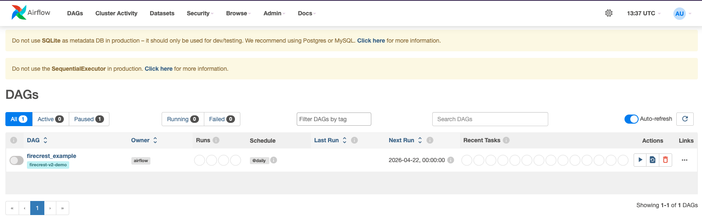
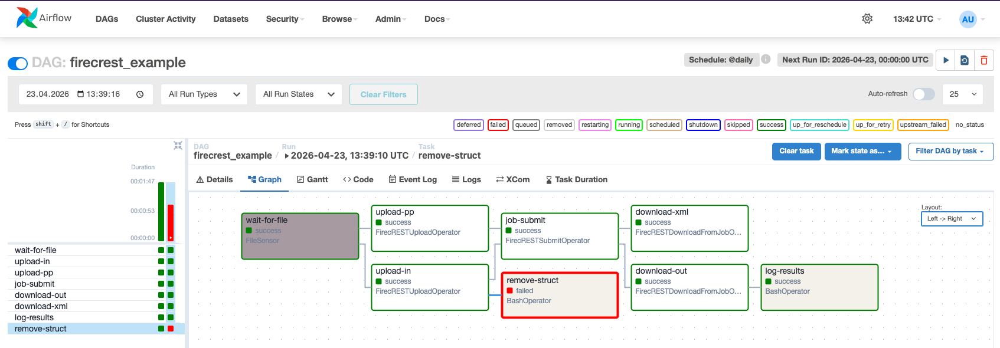

# FirecREST Operators for Airflow

## Goal

Write custom [Apache Airflow operators](https://airflow.apache.org/docs/apache-airflow/stable/howto/custom-operator.html) that use FirecREST to execute compute-intensive DAG tasks on an HPC cluster.

The DAG combines tasks that run locally on a laptop with tasks that must run on a supercomputer. Your operators extend Airflow's `BaseOperator` and use PyFirecREST in their `execute` method:

!!! example "`FirecRESTCustomOperator` definition"
    ```python
    class FirecRESTCustomOperator(BaseOperator):
        def __init__(self, system, script, working_dir, **kwargs):
            super().__init__(**kwargs)
            self.system = system
            self.script = script
            self.working_dir = working_dir

        def execute(self, context):
            # PyFirecREST operations
            ...
    ```

## Installation

Create a virtual environment and install the required packages:

!!! example "Create virtual environment for AirFlow"
    ```bash
    $ git clone https://github.com/eth-cscs/firecrest-training.git
    $ cd firecrest-training
    $ python3 -m venv .airflow-demo-env
    $ source .airflow-demo-env/bin/activate
    (.airflow-demo-env) $ pip install -r use-case-airflow-operator/airflow-requirements.txt
    ```

Set your credentials as environment variables (the base operator reads these):

!!! example "Set your environment"
    ```bash
    (.airflow-demo-env) $ export FIRECREST_CLIENT_ID=<client-id>
    (.airflow-demo-env) $ export FIRECREST_CLIENT_SECRET=<client-secret>
    (.airflow-demo-env) $ export AUTH_TOKEN_URL=https://<token-url>
    (.airflow-demo-env) $ export FIRECREST_URL=https://<firecrest-url>
    ```

!!! tip
    You can re-source the `.env` file created on [Local Environment Setup](../demo.md#local-environment-setup)

## Launch Airflow

Initialize the database and start Airflow in standalone mode:

!!! example "Launch Airflow in your laptop"
    ```bash
    (.airflow-demo-env) $ export AIRFLOW_HOME=$HOME/airflow-demo
    (.airflow-demo-env) $ airflow db migrate
    (.airflow-demo-env) $ airflow standalone
    ```

The dashboard is available at <http://127.0.0.1:8080>. Credentials are printed at startup and saved to `$AIRFLOW_HOME/standalone_admin_password.txt`.

!!! tip
    Set `load_examples = False` in `$AIRFLOW_HOME/airflow.cfg` to start with a clean dashboard.
    To change the port, set `web_server_port` under the `[webserver]` section in `airflow.cfg`.

## Deploy the DAG

By copying the DAG file to the `$AIRFLOW_HOME/dags` directory, it will register the DAG and install the custom operators in the Airflow server.

!!! example "Deploy the FirecREST DAG"
    ```bash
    (.airflow-demo-env) $ mkdir -p $AIRFLOW_HOME/dags
    (.airflow-demo-env) $ cp use-case-airflow-operator/airflow-dag.py $AIRFLOW_HOME/dags/

    # Install the custom operators into the Python path
    (.airflow-demo-env) $ pip install -e use-case-airflow-operator/
    ```

Open `$AIRFLOW_HOME/dags/airflow-dag.py` and set:

- `workdir` to the absolute path of the `use-case-airflow-operators` directory
- `<username>` to your course username

!!! tip "For MacOS users"
    If the DAG appears loaded but with errors, export the following variable:
    ```bash
    (.airflow-demo-env) $ export OBJC_DISABLE_INITIALIZE_FORK_SAFETY=YES # and then execute again 
    (.airflow-demo-env) $ airflow standalone
    ```

## Exercise

The provided DAG (`firecrest_example`) models a crystal structure simulation workflow with these tasks:

1. Detect that a new structure has been produced (`wait_for_file`)
2. Upload the structure and its pseudopotential to Daint (`upload_in` and `upload_pp`)
3. Submit a job to compute its properties (`submit_task`)
4. Download the output (`download_out_task` and `download_xml`)
5. Log relevant values to a table (`log_results`)
6. Delete the structure file (`remove_struct`)

The file [`firecrest_airflow_operators.py`](https://github.com/eth-cscs/firecrest-training/blob/main/use-case-airflow-operator/firecrest_airflow_operators.py) contains the operator implementations to complete.

Trigger the DAG from the Airflow dashboard by clicking the **Play** button next to `firecrest_example` as shown in the image below



### Workflow progress

- The first stage `wait-for-file` is waiting for the file `si.scf.in` to be present in the `structs` folder.
- Copy the file to the folder and wait for the workflow to continue
- See the process on the Graph view of Airflow

